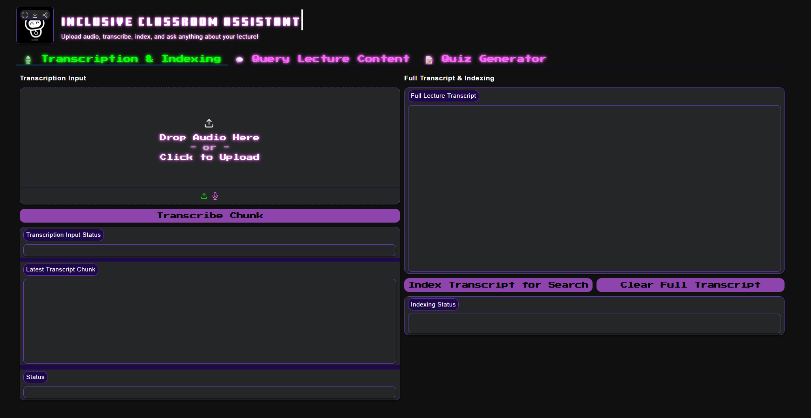
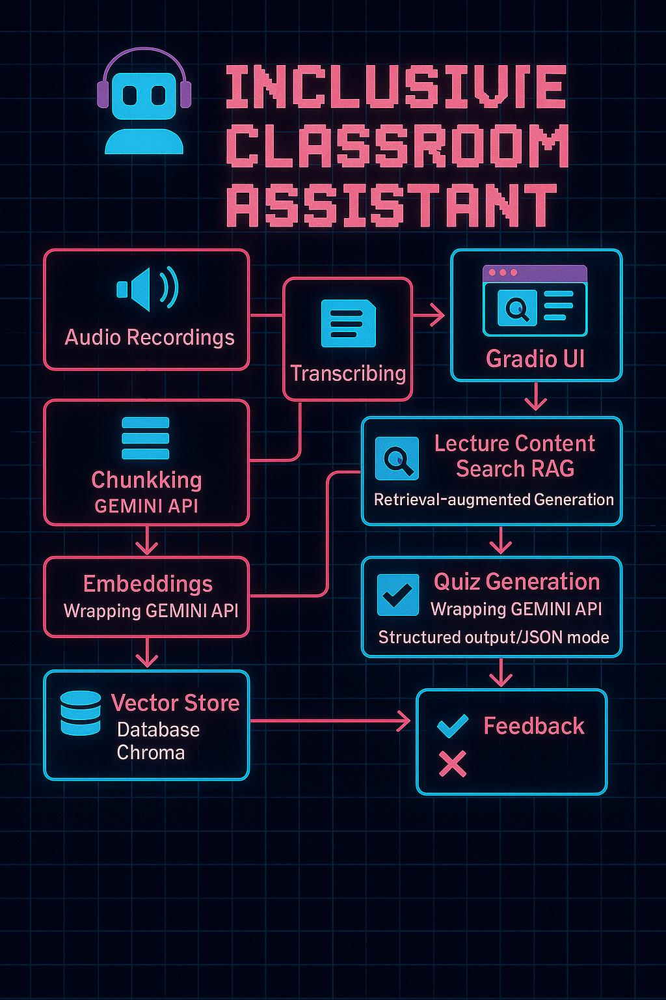

# 🎓 GenAI Meets Education: The Inclusive Classroom Assistant 📚

[](https://huggingface.co/spaces/MonaHamid/inclusive-classroom-assistant)
[](https://medium.com/@hunyeechong/genai-meets-education-the-inclusive-classroom-assistant-36e13b817265)
[](https://youtu.be/U2-jb8TxTiQ)

Making classrooms accessible for everyone! This project tackles the challenge faced by students, particularly those who are deaf or hard-of-hearing, in following live lectures. The **Inclusive Classroom Assistant** is an AI-powered tool that transforms spoken lectures into interactive, searchable, and engaging learning resources.

Using Generative AI, Retrieval-Augmented Generation (RAG), and a fun, retro-themed Gradio interface, this assistant provides:
*   **Accurate Transcription:** Converts lecture audio into text.
*   **Intelligent Q&A:** Answers questions based *only* on the lecture content.
*   **Automated Quizzes:** Generates quizzes for self-assessment and engagement.



## 🌟 Key Features

*   **🎙️ Audio Transcription:** Upload lecture audio (e.g., `.wav`, `.mp3`) and get a text transcript using Google's Gemini Speech-to-Text.
*   **🧠 Semantic Search & Q&A (RAG):** Ask natural language questions about the lecture. The system retrieves relevant sections from the transcript and uses Gemini to generate grounded answers, avoiding external knowledge or hallucinations.
*   **📝 Automated Quiz Generation:** Create multiple-choice quizzes directly from the lecture transcript with structured JSON output for reliability.
*   **🎮 Interactive Quiz Interface:** Take quizzes with immediate feedback, scoring, and a fun "streak" tracker, all presented in a retro-gaming style.
*   **🎨 Custom Retro UI:** Engaging Gradio interface with pixel fonts, neon highlights, and arcade-style elements.

## ✨ GenAI Capabilities Implemented

This project leverages several cutting-edge Generative AI techniques:

1.  **Audio Understanding:** Utilizes **Gemini's Speech-to-Text** models (`gemini-2.0-flash`) via its API to accurately transcribe spoken lecture audio.
2.  **Embeddings & Vector Database:** Lecture transcripts are chunked and converted into semantic embeddings using **Gemini's `text-embedding-004` model**. These embeddings are stored in **ChromaDB** for efficient similarity search.
3.  **Vector Search:** Natural language questions trigger vector similarity lookups in ChromaDB to find the most relevant lecture segments.
4.  **Retrieval-Augmented Generation (RAG):** Combines ChromaDB's retrieval capabilities with **Gemini Flash's** generative power. The LangChain framework orchestrates this, ensuring answers are contextually relevant and grounded *solely* in the provided lecture transcript.
5.  **Few-Shot Prompting:** Used in both the RAG Q&A chain and the Quiz Generation chain. Examples are provided within the prompts to guide Gemini in generating accurate, well-formatted responses, even handling minor transcription errors (e.g., recognizing "Master Ceto" likely means "Master Sito" based on context).
6.  **Grounding:** The RAG prompt explicitly instructs the LLM to base answers *only* on the retrieved transcript context, preventing hallucinations and ensuring fidelity to the lecture material.
7.  **Structured Output / JSON Mode:** The Quiz Generation prompt requires the LLM to output valid JSON conforming to a specific schema (question, options, answer). LangChain's `JsonOutputParser` ensures the output is machine-readable for the Gradio interface.
8.  **Function Calling (via LangChain):** While not using dynamic LLM function calls, LangChain is used to structure the application flow, chaining together components like retrievers, prompts, LLMs, and output parsers into cohesive pipelines (RAG chain, Quiz chain).

## 🛠️ Tech Stack

*   **Core AI:** Google Gemini API (Flash/Pro for generation, STT, Embeddings)
*   **Orchestration:** LangChain
*   **Vector Store:** ChromaDB
*   **UI Framework:** Gradio
*   **Language:** Python
*   **Key Libraries:** `google-generativeai`, `langchain`, `langchain-google-genai`, `chromadb`, `gradio`, `numpy`, `soundfile`, `python-dotenv`

## 🏗️ Architecture Overview

The system follows a clear workflow: Audio Upload -> Transcription -> Chunking & Indexing -> RAG Q&A / Quiz Generation -> Interactive UI.



For a detailed breakdown, see the [System Architecture documentation](docs/ARCHITECTURE.md).

## 🚀 Setup and Installation

To run this project locally:

1.  **Clone the Repository:**
    ```bash
    git clone https://github.com/solilei/inclusive-classroom-assistant.git
    cd inclusive-classroom-assistant
    ```

2.  **Create a Virtual Environment (Recommended):**
    ```bash
    python -m venv venv
    # On Windows
    venv\Scripts\activate
    # On macOS/Linux
    source venv/bin/activate
    ```

3.  **Install Dependencies:**
    ```bash
    pip install -r requirements.txt
    ```

4.  **Set Up API Key:**
    *   Rename the `.env.example` file to `.env`.
    *   Open the `.env` file and add your Google AI Studio API Key:
        ```
        GOOGLE_API_KEY="YOUR_GOOGLE_API_KEY_HERE"
        ```
    *   *Note: Ensure the Gemini API is enabled in your Google Cloud project.*

5.  **Run the Application:**
    ```bash
    python main.py
    ```

6.  Open your web browser and navigate to the local URL provided by Gradio (usually `http://127.0.0.1:7860`).

## 📝 Usage

1.  **Transcription & Indexing Tab:**
    *   Upload an audio file using the audio input component.
    *   Click "Transcribe Chunk". The transcript will appear, and the full transcript below will update.
    *   Once you have a transcript, click "Index Transcript for Search" to enable the Q&A feature.
    *   Use "Clear Full Transcript" to start over.
2.  **Query Lecture Content Tab:**
    *   Type a question about the indexed lecture content in the text box.
    *   Click "Ask Question". The RAG system will generate an answer based on the transcript.
3.  **Quiz Generator Tab:**
    *   Click "Generate Quiz" to create multiple-choice questions from the transcript.
    *   Select an answer using the option buttons. Feedback and score/streak will update.
    *   Click "Next Question" to proceed through the quiz.

## ⚠️ Limitations

*   **Transcription Accuracy:** Performance depends heavily on audio quality (background noise, accents, clarity, speaker overlap).
*   **Context Window:** Answers are strictly limited to the content of the uploaded lecture transcript. The AI has no external knowledge.
*   **Dependency on Uploads:** Requires manual audio file uploads. Real-time processing is not currently implemented.
*   **Quiz Quality:** Quiz questions are AI-generated and may vary in quality or relevance.

## 🌱 Future Work

*   **Real-time Transcription:** Integrate live audio capture for real-time classroom captioning.
*   **Multimodal Support:** Allow uploading presentation slides (PDF/PPT) alongside audio for richer context.
*   **Adaptive Quizzing:** Tailor quiz difficulty based on user performance.
*   **Error Correction Interface:** Allow users to easily correct transcription errors.

## 📄 License

This project is licensed under the MIT License - see the [LICENSE](LICENSE) file for details.

## 🙏 Acknowledgments

*   Thanks to Google for the Gemini API and Kaggle for the platform where this project originated.

## Contributors ✨

This project was a collaborative effort by:

*   **Jun Loh** - (https://www.linkedin.com/in/jun-loh-trainer/)
*   **Sudharshan Murugesan** - (https://www.linkedin.com/in/sudharshan-murugesan-06096410b/)
*   **Chong Hun Yee** - (www.linkedin.com/in/chong-hun-yee-249b38205)
*   **Fareeda** - (https://www.linkedin.com/in/fareedahamid)