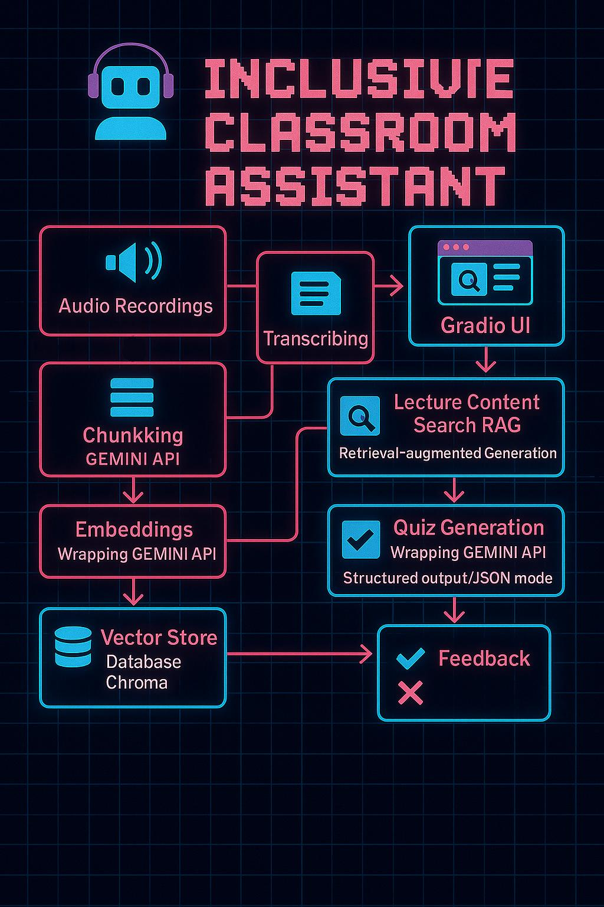

# System Architecture: Inclusive Classroom Assistant

## Overview

The Inclusive Classroom Assistant is designed as a modular system that processes lecture audio to provide accessible and interactive learning tools. It leverages several AI components orchestrated by LangChain and presented through a Gradio user interface. The core flow involves transcribing audio, indexing the text for efficient retrieval, and then using this indexed data for question answering and quiz generation.

## Architecture Diagram

*(Diagram showing the flow from Audio Input -> Gradio UI -> Gemini STT -> Transcript -> Text Splitter -> Gemini Embeddings -> ChromaDB -> RAG Chain (Retriever + Gemini LLM) -> Gradio UI & Quiz Chain (Gemini LLM + Parser) -> Gradio UI)*

## Component Breakdown

1.  **Gradio User Interface:**
    *   Provides the front-end for user interaction.
    *   Handles audio file uploads, text input for questions, button clicks for actions (transcribe, index, ask, generate quiz, select answer, next), and displays outputs (transcripts, answers, quizzes, feedback).
    *   Organized into tabs for different functionalities (Transcription/Indexing, Q&A, Quiz).

2.  **Transcription Module (Gemini STT):**
    *   Receives the audio file path from Gradio.
    *   Uploads the audio file to the Google Gemini API.
    *   Uses a Gemini model (`gemini-2.0-flash` or similar specified in code) with a speech-to-text prompt to convert audio to text.
    *   Returns the raw transcript text.

3.  **Text Processing & Indexing:**
    *   **Text Splitter (LangChain):** Uses `RecursiveCharacterTextSplitter` to break down the potentially long transcript into smaller, overlapping chunks suitable for embedding and retrieval.
    *   **Embedding Model (Gemini):** Uses Gemini's `text-embedding-004` model via `GoogleGenerativeAIEmbeddings` in LangChain to convert each text chunk into a dense vector representation capturing its semantic meaning.
    *   **Vector Store (ChromaDB):** Stores the text chunks and their corresponding embeddings. Enables efficient semantic similarity searches. The database is persisted locally (or configured location).

4.  **Retrieval-Augmented Generation (RAG) Pipeline (LangChain):**
    *   **Retriever:** Uses ChromaDB as the backend. Often enhanced with techniques like `MultiQueryRetriever` which rephrases the user's question to improve search recall from the vector store. Retrieves the most relevant text chunks based on the user's query's vector similarity.
    *   **Prompt Template:** Structures the input to the LLM, including the retrieved context (lecture chunks) and the user's original question. Crucially includes instructions for grounding (answer *only* based on context) and few-shot examples.
    *   **Language Model (Gemini Flash):** Takes the formatted prompt (context + question) and generates a natural language answer.
    *   **Output Parser:** Formats the LLM's raw output (e.g., `StrOutputParser`).

5.  **Quiz Generation Pipeline (LangChain):**
    *   **Prompt Template:** Takes the full transcript as input. Instructs the LLM to generate a specific number (e.g., 5) of multiple-choice questions based *only* on the transcript. Includes few-shot examples and specifies a strict JSON output format.
    *   **Language Model (Gemini Flash):** Generates the quiz questions based on the transcript and prompt instructions.
    *   **JSON Output Parser:** Parses the LLM's output string, validating and converting it into a Python list of dictionaries (or similar structure) that the Gradio UI can easily use.

6.  **State Management:**
    *   Global variables or Gradio `State` objects hold the current full transcript, the initialized ChromaDB instance, the RAG chain, and the state of the current quiz (questions, current index, score, streak).

## Workflow Steps

1.  **Audio Upload:** The user uploads an audio file via the Gradio interface.
2.  **Transcription:** The `Transcribe` button triggers the `handle_transcription_request` function. This calls the `transcribe_audio_chunk` function, which sends the audio to the Gemini STT API and receives the text transcript. The transcript chunk and the updated full transcript are displayed in Gradio.
3.  **Indexing:** The user clicks the `Index Transcript` button, triggering `handle_indexing_request`.
    *   The full transcript text is passed to `chunk_transcript`.
    *   The resulting chunks are passed to `create_vector_db`, which generates embeddings using Gemini and stores them in ChromaDB.
    *   `setup_rag_chain` is called to initialize the RAG pipeline using the created vector store. Status is updated in Gradio.
4.  **Lecture Content Querying (RAG):**
    *   The user types a question in the "Query Lecture Content" tab and clicks `Ask Question`, triggering `handle_query_request`.
    *   This calls `answer_query_using_rag`, which invokes the pre-configured `rag_chain`.
    *   The chain retrieves relevant chunks from ChromaDB based on the query, formats them into a prompt for Gemini Flash, gets the generated answer, and returns it.
    *   The answer is displayed in the Gradio interface.
5.  **Quiz Generation:**
    *   The user clicks `Generate Quiz` in the "Quiz Generator" tab, triggering `generate_quiz_and_buttons`.
    *   This function calls `generate_quiz`, which invokes the pre-configured `quiz_chain` (using `setup_quiz_chain` if not already done).
    *   The quiz chain uses Gemini Flash to generate questions in JSON format based on the full transcript.
    *   The `JsonOutputParser` processes the output.
    *   The quiz state is initialized, and the first question and options are displayed on the Gradio buttons. Scoreboard is reset.
6.  **Interactive Quiz Taking:**
    *   The user clicks an option button, triggering `select_answer_and_update`.
    *   This calls `select_answer`, which checks the choice against the correct answer stored in the quiz state.
    *   Feedback, score, and streak are updated in the quiz state and displayed in Gradio. The question is marked as answered.
    *   The user clicks `Next Question`, triggering `advance_to_next_question`.
    *   This function updates the quiz state to the next question index (if available) and displays the new question/options, resetting the "answered" flag. If the quiz is finished, it displays the final score.